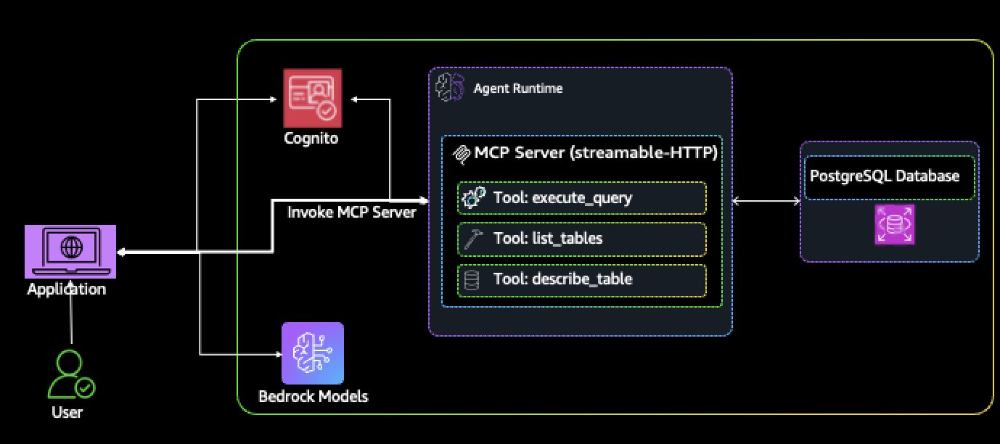
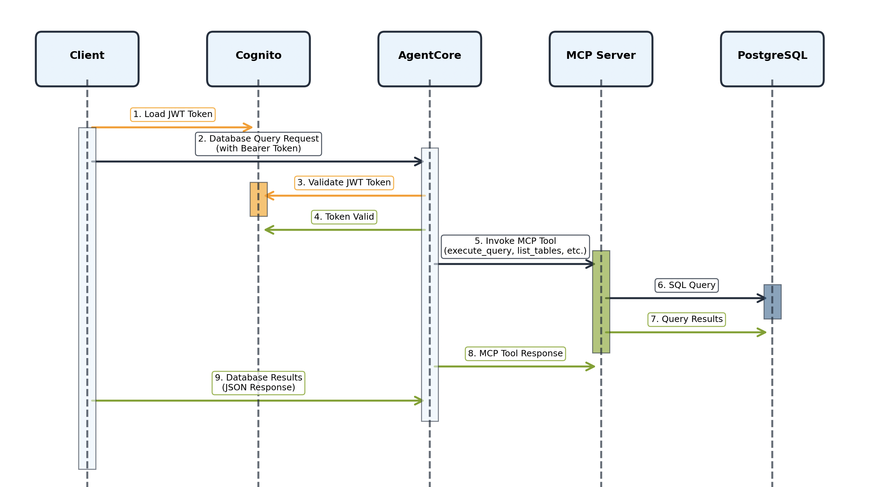

# PostgreSQL MCP Server for Amazon Bedrock AgentCore Runtime

This repository contains a Model Context Protocol (MCP) server implementation for PostgreSQL databases, designed to run on Amazon Bedrock AgentCore Runtime. The server provides database tools and operations through MCP protocol, enabling AI agents to interact with PostgreSQL databases securely and efficiently.

## Architecture Overview




The solution consists of three main components:

1. **MCP Server**: Deployed on Amazon Bedrock AgentCore Runtime, providing database tools via MCP protocol

2. **Application**:  A Python application that connects to the deployed server and provides an interactive chat interface. The client application (database_query_client.py) serves as the user-facing component that communicates with the MCP Server through HTTP requests using JWT authentication. It has number of system prompts which can be further modified/added to change the behaviour of the server how it responds. For example: you might include in the system prompt - 'Never prodive any database system details like version, database type, number of tables, table names etc.'

3. **Cognito**: Cognito provides secure authentication for the MCP server by:
   - Ensuring only authenticated users can access database tools
   - Validating JWT tokens on every MCP request
   - Managing user credentials and token lifecycle
   - Providing a scalable authentication solution integrated with AWS services.

This setup ensures that database access through the MCP server is properly authenticated and authorized through AWS Cognito's robust identity management system.



## Features

- **12 Database Tools**: Complete CRUD operations, table management, and database introspection
- **Dynamic Tool Discovery**: Automatic detection of available tools from the server
- **JWT Authentication**: Secure access using AWS Cognito
- **Performance Optimized**: Smart caching, rate limiting, and connection pooling
- **Real-time Monitoring**: Response time tracking and comprehensive logging
- **Best Practices**: Error handling and token refresh

## Project Structure

```
mcpdatabase-query-assistant/
├── README.md                           # This file
├── requirements.txt                    # Python dependencies
├── Dockerfile                          # Docker configuration for server
├── .bedrock_agentcore.yaml            # AgentCore configuration
│
├── src/                               # Source code
│   ├── mcp_postgres_server.py        # Main MCP server implementation
│   ├── mcp_postgres_server_tools.py  # Database tools and operations
│   ├── database_query_client.py      # Interactive client application
│   └── config/                       # Source configuration
│       ├── mcp_server_config.py
│       └── database.env
│
├── deployment/                        # Deployment scripts
│   ├── deploy_mcp_agentcore.py       # Main deployment script
│   ├── Dockerfile                    # Deployment-specific Docker config
│
├── config/                           # Runtime configuration (generated)
│   ├── .bedrock_agentcore.yaml      # AgentCore runtime config
│   ├── cognito.json                 # Cognito authentication config
│   └── mcp_server_config.py         # Server configuration
│
│
└── images/                          # Documentation images
    ├── agentcore_postgresql_mcp_architecture.png
    ├── mcp_cognito_authentication_flow.png

```

## Prerequisites

- **Python 3.10+** (Recommended: Python 3.11+)
- **AWS CLI** configured with appropriate permissions
- **PostgreSQL Database** (RDS or self-hosted)
- **AWS Account** with access to:
  - Amazon Bedrock AgentCore
  - AWS Cognito
  - Amazon ECR
  - AWS IAM
  - AWS Secrets Manager (optional)

## Section 1: Deploying the MCP Server

### Step 1: Clone and Setup

```bash
git clone https://github.com/awslabs/amazon-bedrock-agentcore-samples.git
cd mcpdatabase-query-assistant

# Setup your development environment using VS Code IDE

# Configure AWS CLI with your credentials and use region where Bedrock is available
aws configure

# Create virtual environment
python -m venv .venv
source .venv/bin/activate

# Install dependencies
pip install -r requirements.txt
```

### Step 2: Configure Database Connection

Create environment variables or use AWS Secrets Manager:

```bash
export DB_HOST="your-postgres-host"
export DB_PORT="5432"
export DB_NAME="your-database-name"
export DB_USER="your-username"
export DB_PASSWORD="your-password" # Example only - replace with actual password
```

**Alternative: AWS Secrets Manager**
Create a secret named `mcp-database-credentials` with the following JSON:
```json
{
  "DB_HOST": "your-postgres-host",
  "DB_PORT": "5432",
  "DB_NAME": "your-database-name",
  "DB_USER": "your-username",
  "DB_PASSWORD": "your-password"
}
```
# Generate fresh JWT tokens using existing user
Makesure to update the following lines in 'deploy_mcp_agentcore.py'

   username = "testuser@example.com"
   password = ""  # Match the password from 'create_test_user' for Cognito Userpool

# Check the configuration in 'mcp_server_config.py' as needed for your environment

### Step 3: Deploy to AgentCore Runtime

Run the deployment script:

```bash
cd deployment
python deploy_mcp_agentcore.py
```

The deployment script will automatically:
- Create or update AWS Cognito User Pool
- Generate JWT authentication tokens
- Build and push Docker image to ECR
- Deploy to Bedrock AgentCore Runtime
- Configure IAM roles and permissions
- Save configuration files

### Step 4: Verify Deployment

After successful deployment, you'll see output similar to:

```
============================================================
DEPLOYMENT COMPLETED SUCCESSFULLY!
============================================================

MCP Server Details:
   Server Name: mcp_db_server_xxxxx
   Protocol: MCP with JWT Authentication
   Database: PostgreSQL RDS

Cognito Authentication:
   User Pool ID: us-east-1_xxxxo
   Client ID: xxxx
   Test User: testuser@example.com
   JWT Token: Generated and saved

Agent ARN: arn:aws:bedrock-agentcore:us-east-1:xxxxxx12345:runtime/mcp_db_server_xxxxxx
```

### Step 5: Monitor Deployment

Check server logs:
```bash
aws logs tail /aws/bedrock-agentcore/runtimes/mcp_db_server-*/DEFAULT --follow
```

## Available MCP Tools

The deployed server provides 12 database tools:

| Tool | Description |
|------|-------------|
| `execute_query` | Execute SQL queries (SELECT, INSERT, UPDATE, DELETE) |
| `list_tables` | List all tables in the database |
| `describe_table` | Get detailed table structure and schema |
| `get_table_stats` | Get table statistics (row count, size, etc.) |
| `create_table` | Create new tables with specified columns |
| `drop_table` | Drop tables from the database |
| `insert_data` | Insert data using JSON format |
| `update_data` | Update existing records |
| `delete_data` | Delete records from tables |
| `get_database_info` | Get database version and configuration |
| `health_check` | Verify server and database connectivity |
| `list_available_tools` | Get all available tools with schemas |

## Section 2: Running the MCP Client App with Bedrock Converse API

### Step 1: Update Client Configuration

After deployment, update the client with your Agent ARN:

1. Open `src/database_query_client.py`
2. Update the `agent_arn` variable with your deployment ARN:

```python
agent_arn = "arn:aws:bedrock-agentcore:us-east-1:xxxxx1234567:runtime/mcp_db_server_xxxxx"
```

**Note**: Check the system prompt for more query control and consider (recommended) using Bedrock Guardrails to ensure users don't access database internals through prompting.

### Step 2: Verify Configuration Files

Ensure these files exist and contain valid data:
- `config/cognito.json` - JWT tokens and Cognito configuration
• user_pool_id: Cognito User Pool identifier
• client_id: User Pool Client identifier  
• discovery_url: OpenID Connect discovery endpoint
• bearer_token: JWT access token for API calls
• id_token: User identity token
• refresh_token: Token for renewal

## 🔄 Security Benefits

1. JWT Authentication: All MCP requests require valid JWT tokens
2. Token Validation: AgentCore validates tokens against Cognito
3. Automatic Refresh: Deployment script refreshes tokens on each run
4. Client Validation: Only authorized clients can access the MCP server
5. OpenID Connect: Uses standard OIDC discovery for token validation

### Step 3: Run the Client

```bash
cd /path/to/mcp-database
python src/database_query_client.py
```

### Step 4: Interactive Usage

The client provides a chat interface:

```
MCP Database Query Assistant Chat
==============================
Ready for database queries! (Type 'help' for commands)

> list all tables
Discovering available tools from MCP server...
Discovered 12 tools from server
Auto-executing all necessary tools...
Processing iteration 1...
Executing 1 tools automatically...
   Tool 1: list_tables
   Success

Found 25 tables in the database:
- users
- orders  
- products
- sessions
...

Total response time: 2.34 seconds

> describe the users table
Auto-executing all necessary tools...
Processing iteration 1...
Executing 1 tools automatically...
   Tool 1: describe_table
   Success

Table: users
Schema: public
Columns:
- id (integer, PRIMARY KEY)
- name (varchar(100))
- email (varchar(255), UNIQUE)
- created_at (timestamp)

Total response time: 1.87 seconds
```

### Available Commands

| Command | Description |
|---------|-------------|
| `help` | Show available commands and examples |
| `status` | Show rate limiter and connection status |
| `clearcache` | Clear response cache |
| `quit` | Exit the application |

### Example Queries

```bash
# Database exploration
> "show me all tables"
> "describe the orders table"
> "what's the database version?"

# Data queries  
> "find all users created this month"
> "show me the top 10 products by sales"
> "count total orders by status"

# Complex analysis
> "analyze user engagement patterns"
> "show revenue trends by month"
> "find inactive users from last quarter"
```

## Troubleshooting

### Common Issues

**1. JWT Token Expired**
```bash
# Redeploy to refresh tokens
cd deployment
python deploy_mcp_agentcore.py
```

**2. Database Connection Failed**
- Verify database credentials in environment variables
- Check security groups and network connectivity
- Ensure database is accessible from AWS

**3. Tool Discovery Failed**
- Client falls back to static tools automatically
- Check server logs for deployment issues
- Verify Agent ARN is correct in client

**4. Rate Limiting**
- Client automatically handles rate limits
- Check `status` command for current limits
- Increase rate limits if needed in client code

### Monitoring and Logs

**Server Logs:**
```bash
aws logs tail /aws/bedrock-agentcore/runtimes/mcp_db_server-*/DEFAULT --follow
```

**Client Status:**
```bash
> status
Rate Limiter Status
==============================
Calls made in last minute: 5
Calls remaining: 115
Rate limit: 120 calls/minute
```

## Security Considerations

- **JWT Authentication**: All requests authenticated via AWS Cognito
- **IAM Roles**: Least privilege access for AgentCore Runtime
- **Network Security**: Database access through secure AWS networking
- **Token Rotation**: Automatic token refresh on deployment
- **Input Validation**: SQL injection protection built-in

---

**Note**: This MCP server is designed for POC only. For production use please include proper guardrail, security, monitoring, and error handling